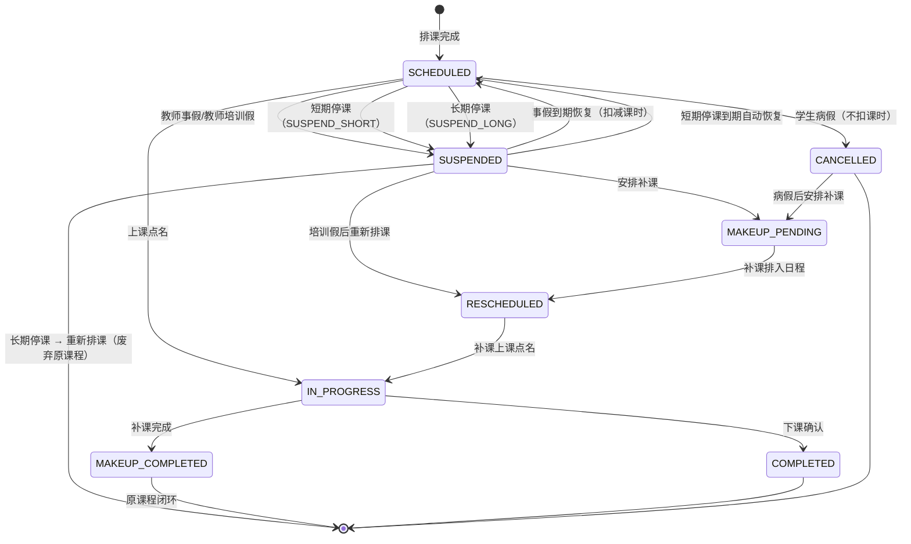
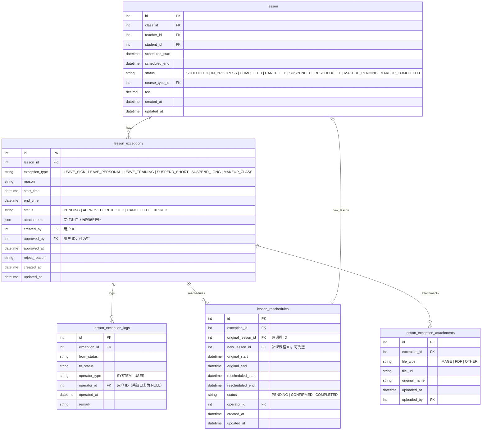

# EduOS 课程异常流程设计文档

> **版本**: v1.0  
> **日期**: 2026-07-25  
> **状态**: 设计稿  
> **关联 Mission**: M-EDUOS-LESSON-EXCEPTION-FLOW-V1  

---

## 目录

1. [概述](#1-概述)
2. [异常类型定义](#2-异常类型定义)
3. [状态机模型](#3-状态机模型)
4. [数据模型设计](#4-数据模型设计)
5. [API 设计](#5-api-设计)
6. [业务规则](#6-业务规则)
7. [测试用例](#7-测试用例)

---

## 1. 概述

### 1.1 设计目标

EduOS 需要系统化支持真实教育机构的异常运营场景（请假、停课、补课）。本设计通过 **Lesson 状态变更** 实现异常流程驱动，确保：

- **课时统计准确性**：异常状态不影响已完成的课时统计和工资计算
- **状态流转可追溯**：每次状态变更都有完整审计日志
- **数据一致性**：异常记录与课程状态始终联动
- **流程可恢复**：异常结束后课程可自动/手动恢复

### 1.2 核心原则

| # | 原则 | 说明 |
|---|------|------|
| 1 | **状态驱动** | 所有异常流程通过 Lesson 状态变更实现，不直接修改课时数量 |
| 2 | **流转清晰** | 每个异常类型对应明确的状态，状态转换有明确的触发条件 |
| 3 | **可追溯** | 状态转换记录完整的操作人、时间、备注 |
| 4 | **隔离性** | 异常流程不影响已完成的课时统计和工资计算 |

---

## 2. 异常类型定义

### 2.1 异常类型枚举

| 异常码 | 名称 | 说明 | 适用角色 | 计费影响 |
|--------|------|------|----------|----------|
| `LEAVE_SICK` | 病假 | 学生/教师因生病请假 | 学生、教师 | ❌ 不扣课时 |
| `LEAVE_PERSONAL` | 事假 | 因私事请假 | 学生、教师 | ✅ 扣减课时 |
| `LEAVE_TRAINING` | 培训假 | 教师参加培训请假 | 教师 | ❌ 不扣课时 |
| `SUSPEND_SHORT` | 短期停课 | 1-7 天临时停课 | 机构运营 | ✅ 自动恢复 |
| `SUSPEND_LONG` | 长期停课 | 7 天以上长时间停课 | 机构运营 | ✅ 需重新排课 |
| `MAKEUP_CLASS` | 补课 | 因异常需要补课 | 机构运营 | ❌ 不重复扣课时 |

### 2.2 异常办理条件

| 异常类型 | 提前期要求 | 所需材料 | 审批层级 |
|----------|-----------|----------|----------|
| `LEAVE_SICK` | 可当天补申请 | 医院证明（二级甲等以上） | 教务主管 |
| `LEAVE_PERSONAL` | 至少提前 24h | 无 | 教务主管 |
| `LEAVE_TRAINING` | 至少提前 48h | 培训通知/邀请函 | 教学总监 |
| `SUSPEND_SHORT` | — | 机构公告 | 教学总监 |
| `SUSPEND_LONG` | — | 机构公告 + 排课方案 | 校区负责人 |
| `MAKEUP_CLASS` | — | 关联异常记录 | 教务主管 |

---

## 3. 状态机模型

### 3.1 Lesson 状态全集

| 状态 | 含义 | 是否终态 |
|------|------|----------|
| `SCHEDULED` | 已排课（待上课） | ❌ |
| `IN_PROGRESS` | 上课中 | ❌ |
| `COMPLETED` | 已完成（正常结课） | ✅ |
| `CANCELLED` | 已取消（异常结束，不扣课时） | ✅ |
| `SUSPENDED` | 已挂起（待恢复/待补课） | ❌ |
| `RESCHEDULED` | 已改期（排入新时间） | ❌ |
| `MAKEUP_PENDING` | 待补课 | ❌ |
| `MAKEUP_COMPLETED` | 补课完成（原课程闭环） | ✅ |

### 3.2 Lesson 状态机图



### 3.3 状态转换矩阵

| 当前状态 ↓ \ 目标状态 → | `SCHEDULED` | `IN_PROGRESS` | `COMPLETED` | `CANCELLED` | `SUSPENDED` | `RESCHEDULED` | `MAKEUP_PENDING` | `MAKEUP_COMPLETED` |
|---|---|---|---|---|---|---|---|---|
| `SCHEDULED` | — | ✅ 上课点名 | ❌ | ✅ 病假 | ✅ 事假/停课 | ❌ | ❌ | ❌ |
| `IN_PROGRESS` | ❌ | — | ✅ 下课确认 | ❌ | ❌ | ❌ | ❌ | ❌ |
| `COMPLETED` | ❌ | ❌ | — | ❌ | ❌ | ❌ | ❌ | ❌ |
| `CANCELLED` | ❌ | ❌ | ❌ | — | ❌ | ❌ | ✅ 安排补课 | ❌ |
| `SUSPENDED` | ✅ 到期恢复 | ❌ | ❌ | ❌ | — | ✅ 重新排课 | ✅ 安排补课 | ❌ |
| `RESCHEDULED` | ❌ | ✅ 补课上课 | ❌ | ❌ | ❌ | — | ❌ | ❌ |
| `MAKEUP_PENDING` | ❌ | ❌ | ❌ | ❌ | ❌ | ✅ 排日程 | — | ❌ |
| `MAKEUP_COMPLETED` | ❌ | ❌ | ❌ | ❌ | ❌ | ❌ | ❌ | — |

### 3.4 状态转换触发条件

| 转换路径 | 触发条件 | 所需角色 | 备注 |
|----------|----------|----------|------|
| `SCHEDULED → IN_PROGRESS` | 教师点击上课，当前时间在课时段内 | 教师 | — |
| `IN_PROGRESS → COMPLETED` | 教师点击下课，学生点名完成 | 教师 | 触发工资计算事件 |
| `SCHEDULED → CANCELLED` | 学生病假审批通过 | 教务主管 | 不扣课时 |
| `SCHEDULED → SUSPENDED` | 教师事假/培训假/停课审批通过 | 教务主管/总监 | — |
| `SUSPENDED → SCHEDULED` | 事假到期自动恢复 | 系统自动 | 扣减已消耗课时 |
| `SUSPENDED → SCHEDULED` | 短期停课到期自动恢复 | 系统自动 | — |
| `SUSPENDED → RESCHEDULED` | 培训假后重新排课 | 教务 | — |
| `SUSPENDED → [废弃]` | 长期停课 → 原课程废弃 | 教务 | 重新排课 |
| `SUSPENDED → MAKEUP_PENDING` | 教师安排补课 | 教务主管 | — |
| `CANCELLED → MAKEUP_PENDING` | 病假后安排补课补回课时 | 教务主管 | — |
| `MAKEUP_PENDING → RESCHEDULED` | 补课时间确定 | 教务 | 关联原课程 ID |
| `RESCHEDULED → IN_PROGRESS` | 补课上课点名 | 教师 | — |
| `IN_PROGRESS → MAKEUP_COMPLETED` | 补课下课确认 | 教师 | 原课程闭环 |

---

## 4. 数据模型设计

### 4.1 ER 图



### 4.2 表结构定义

#### 4.2.1 `lesson_exceptions` — 异常记录表

| 字段 | 类型 | 约束 | 说明 |
|------|------|------|------|
| `id` | `BIGINT UNSIGNED` | PK, AUTO_INCREMENT | 主键 |
| `lesson_id` | `BIGINT UNSIGNED` | NOT NULL, FK → lesson.id | 关联课程 |
| `exception_type` | `VARCHAR(32)` | NOT NULL | 异常类型枚举 |
| `reason` | `VARCHAR(500)` | NOT NULL | 申请原因 |
| `start_time` | `DATETIME` | NOT NULL | 异常开始时间 |
| `end_time` | `DATETIME` | NULL | 异常结束时间（可为空） |
| `status` | `VARCHAR(32)` | NOT NULL, DEFAULT 'PENDING' | 审批状态 |
| `attachments` | `JSON` | NULL | 附件元数据 |
| `created_by` | `BIGINT UNSIGNED` | NOT NULL, FK → users.id | 申请人 |
| `approved_by` | `BIGINT UNSIGNED` | NULL, FK → users.id | 审批人 |
| `approved_at` | `DATETIME` | NULL | 审批时间 |
| `reject_reason` | `VARCHAR(500)` | NULL | 拒绝原因 |
| `created_at` | `DATETIME` | NOT NULL, DEFAULT CURRENT_TIMESTAMP | — |
| `updated_at` | `DATETIME` | NOT NULL, ON UPDATE CURRENT_TIMESTAMP | — |

**索引**:

| 索引名 | 字段 | 说明 |
|--------|------|------|
| `idx_lesson_id` | `lesson_id` | 按课程查询异常记录 |
| `idx_exception_type` | `exception_type` | 按异常类型过滤 |
| `idx_status` | `status` | 按审批状态查询 |
| `idx_created_by` | `created_by` | 按申请人查询 |
| `idx_created_at` | `created_at` | 按时间排序 |

**状态流转**:

```
PENDING → [APPROVED] → APPROVED → [REJECTED] → REJECTED
PENDING → [CANCELLED] → CANCELLED
APPROVED → [EXPIRED] → EXPIRED (异常结束后自动标记)
```

#### 4.2.2 `lesson_exception_logs` — 状态流转日志表

| 字段 | 类型 | 约束 | 说明 |
|------|------|------|------|
| `id` | `BIGINT UNSIGNED` | PK, AUTO_INCREMENT | 主键 |
| `exception_id` | `BIGINT UNSIGNED` | NOT NULL, FK → lesson_exceptions.id | 关联异常记录 |
| `from_status` | `VARCHAR(32)` | NOT NULL | 变更前状态 |
| `to_status` | `VARCHAR(32)` | NOT NULL | 变更后状态 |
| `operator_type` | `VARCHAR(16)` | NOT NULL, DEFAULT 'USER' | 操作人类型：SYSTEM/USER |
| `operator_id` | `BIGINT UNSIGNED` | NULL | 操作人 ID |
| `operated_at` | `DATETIME` | NOT NULL, DEFAULT CURRENT_TIMESTAMP | 操作时间 |
| `remark` | `VARCHAR(500)` | NULL | 备注说明 |

**索引**:

| 索引名 | 字段 | 说明 |
|--------|------|------|
| `idx_exception_id` | `exception_id` | 查询某异常的完整日志 |
| `idx_operated_at` | `operated_at` | 按时间范围查询 |

#### 4.2.3 `lesson_reschedules` — 补课排期表

| 字段 | 类型 | 约束 | 说明 |
|------|------|------|------|
| `id` | `BIGINT UNSIGNED` | PK, AUTO_INCREMENT | 主键 |
| `exception_id` | `BIGINT UNSIGNED` | NOT NULL, FK → lesson_exceptions.id | 关联异常记录 |
| `original_lesson_id` | `BIGINT UNSIGNED` | NOT NULL, FK → lesson.id | 原课程 ID |
| `new_lesson_id` | `BIGINT UNSIGNED` | NULL, FK → lesson.id | 补课课程 ID（排定后写入） |
| `original_start` | `DATETIME` | NOT NULL | 原上课时间 |
| `original_end` | `DATETIME` | NOT NULL | 原下课时间 |
| `rescheduled_start` | `DATETIME` | NOT NULL | 补课时间 |
| `rescheduled_end` | `DATETIME` | NOT NULL | 补课结束时间 |
| `status` | `VARCHAR(32)` | NOT NULL, DEFAULT 'PENDING' | PENDING → CONFIRMED → COMPLETED |
| `operator_id` | `BIGINT UNSIGNED` | NOT NULL | 操作人 |
| `created_at` | `DATETIME` | NOT NULL | — |
| `updated_at` | `DATETIME` | NOT NULL, ON UPDATE CURRENT_TIMESTAMP | — |

**索引**:

| 索引名 | 字段 | 说明 |
|--------|------|------|
| `idx_original_lesson` | `original_lesson_id` | 查原课程的补课安排 |
| `idx_new_lesson` | `new_lesson_id` | 查补课课程的关联关系 |

#### 4.2.4 `lesson_exception_attachments` — 附件表

| 字段 | 类型 | 约束 | 说明 |
|------|------|------|------|
| `id` | `BIGINT UNSIGNED` | PK, AUTO_INCREMENT | 主键 |
| `exception_id` | `BIGINT UNSIGNED` | NOT NULL, FK → lesson_exceptions.id | 关联异常记录 |
| `file_type` | `VARCHAR(16)` | NOT NULL | IMAGE / PDF / OTHER |
| `file_url` | `VARCHAR(500)` | NOT NULL | 文件存储路径 |
| `original_name` | `VARCHAR(255)` | NOT NULL | 原始文件名 |
| `uploaded_at` | `DATETIME` | NOT NULL | — |
| `uploaded_by` | `BIGINT UNSIGNED` | NOT NULL | 上传人 |

---

## 5. API 设计

### 5.1 API 概览

| 类别 | 方法 | 路径 | 功能 | 角色 |
|------|------|------|------|------|
| 请假 | `POST` | `/api/lessons/{id}/leave` | 申请请假 | 教师/学生 |
| 请假 | `GET` | `/api/lessons/leave-requests` | 请假申请列表 | 教务主管 |
| 请假 | `PUT` | `/api/lessons/leave-requests/{id}/approve` | 审批请假 | 教务主管 |
| 停课 | `POST` | `/api/lessons/{id}/suspend` | 申请停课 | 教务 |
| 停课 | `GET` | `/api/lessons/suspend-requests` | 停课申请列表 | 教务主管 |
| 停课 | `PUT` | `/api/lessons/suspend-requests/{id}/approve` | 审批停课 | 教学总监 |
| 补课 | `POST` | `/api/lessons/{id}/makeup` | 申请补课 | 教务主管 |
| 补课 | `GET` | `/api/lessons/makeup-requests` | 补课申请列表 | 教务主管 |
| 补课 | `PUT` | `/api/lessons/makeup-requests/{id}/approve` | 审批补课 | 教学总监 |
| 查询 | `GET` | `/api/lessons/{id}/exceptions` | 课程异常记录 | 教师/教务 |
| 查询 | `GET` | `/api/lessons/exceptions/statistics` | 异常统计 | 教务主管 |

### 5.2 请求/响应 Schema

#### 5.2.1 请假申请

**POST** `/api/lessons/{id}/leave`

**Request Body**:

```json
{
  "exception_type": "LEAVE_SICK",
  "reason": "感冒发烧，体温38.5℃",
  "start_time": "2026-07-26T09:00:00",
  "end_time": "2026-07-26T10:30:00",
  "attachment_urls": [
    "https://oss.eduos.com/evidences/abc123.jpeg"
  ]
}
```

| 字段 | 类型 | 必填 | 说明 |
|------|------|------|------|
| `exception_type` | `string` | ✅ | `LEAVE_SICK` / `LEAVE_PERSONAL` / `LEAVE_TRAINING` |
| `reason` | `string` | ✅ | 请假原因（最长 500 字） |
| `start_time` | `string` (datetime) | ✅ | 请假开始时间 |
| `end_time` | `string` (datetime) | ✅ | 请假结束时间 |
| `attachment_urls` | `string[]` | 病假必填 | 附件文件 URL 列表 |

**Response** `201 Created`:

```json
{
  "id": 1,
  "lesson_id": 101,
  "exception_type": "LEAVE_SICK",
  "reason": "感冒发烧，体温38.5℃",
  "status": "PENDING",
  "created_by": 42,
  "created_at": "2026-07-25T10:30:00Z"
}
```

#### 5.2.2 查询请假申请列表

**GET** `/api/lessons/leave-requests`

**Query Parameters**:

| 参数 | 类型 | 必填 | 说明 |
|------|------|------|------|
| `status` | `string` | ❌ | 按审批状态过滤：`PENDING` / `APPROVED` / `REJECTED` |
| `exception_type` | `string` | ❌ | 按类型过滤：`LEAVE_SICK` / `LEAVE_PERSONAL` / `LEAVE_TRAINING` |
| `created_by` | `int` | ❌ | 按申请人 ID 过滤 |
| `start_date` | `string` (date) | ❌ | 申请时间范围起始 |
| `end_date` | `string` (date) | ❌ | 申请时间范围结束 |
| `page` | `int` | ❌, default=1 | 页码 |
| `page_size` | `int` | ❌, default=20 | 每页条数 |

**Response** `200 OK`:

```json
{
  "total": 42,
  "page": 1,
  "page_size": 20,
  "items": [
    {
      "id": 1,
      "lesson_id": 101,
      "lesson_info": {
        "course_name": "数学提高班",
        "teacher_name": "张老师",
        "student_name": "李小明",
        "scheduled_start": "2026-07-26T09:00:00"
      },
      "exception_type": "LEAVE_SICK",
      "reason": "感冒发烧",
      "status": "PENDING",
      "created_by": {
        "id": 42,
        "name": "李小明",
        "role": "student"
      },
      "created_at": "2026-07-25T10:30:00Z",
      "attachment_count": 1
    }
  ]
}
```

#### 5.2.3 审批请假

**PUT** `/api/lessons/leave-requests/{id}/approve`

**Request Body**:

```json
{
  "action": "APPROVE",
  "remark": "同意请假，学生提供医院证明齐全"
}
```

| 字段 | 类型 | 必填 | 说明 |
|------|------|------|------|
| `action` | `string` | ✅ | `APPROVE` 或 `REJECT` |
| `remark` | `string` | ❌ | 审批备注（拒绝时必须填写原因） |

**Response** `200 OK`:

```json
{
  "id": 1,
  "status": "APPROVED",
  "approved_by": 5,
  "approved_at": "2026-07-25T11:00:00Z",
  "lesson_status": "CANCELLED"
}
```

#### 5.2.4 申请停课

**POST** `/api/lessons/{id}/suspend`

**Request Body**:

```json
{
  "exception_type": "SUSPEND_SHORT",
  "reason": "校区电路检修，需停课三天",
  "start_time": "2026-07-28T00:00:00",
  "end_time": "2026-07-30T23:59:59",
  "affected_lesson_ids": [101, 102, 103],
  "auto_restore": true
}
```

| 字段 | 类型 | 必填 | 说明 |
|------|------|------|------|
| `exception_type` | `string` | ✅ | `SUSPEND_SHORT` / `SUSPEND_LONG` |
| `reason` | `string` | ✅ | 停课原因 |
| `start_time` | `string` (datetime) | ✅ | 停课开始时间 |
| `end_time` | `string` (datetime) | ✅ | 停课结束时间 |
| `affected_lesson_ids` | `int[]` | ✅ | 受影响的课程 ID 列表 |
| `auto_restore` | `bool` | ❌, default=true | 短期停课是否自动恢复 |

**Response** `201 Created`:

```json
{
  "id": 2,
  "exception_type": "SUSPEND_SHORT",
  "affected_lessons": 3,
  "status": "PENDING",
  "auto_restore": true,
  "created_at": "2026-07-25T12:00:00Z"
}
```

#### 5.2.5 查询停课申请列表

**GET** `/api/lessons/suspend-requests`

参数同请假查询（5.2.2），`exception_type` 按 `SUSPEND_SHORT` / `SUSPEND_LONG` 过滤。

#### 5.2.6 审批停课

**PUT** `/api/lessons/suspend-requests/{id}/approve`

同请假审批接口（5.2.3）。

**额外逻辑**（审批通过时自动执行）：

- `SUSPEND_SHORT`：将关联课程的 `status` 置为 `SUSPENDED`，记录自动恢复时间
- `SUSPEND_LONG`：将关联课程的 `status` 置为 `SUSPENDED`

#### 5.2.7 申请补课

**POST** `/api/lessons/{id}/makeup`

**Request Body**:

```json
{
  "exception_id": 1,
  "rescheduled_start": "2026-07-28T14:00:00",
  "rescheduled_end": "2026-07-28T15:30:00",
  "teacher_id": 15,
  "room_id": 3,
  "remark": "将病假课程补到本周五下午"
}
```

| 字段 | 类型 | 必填 | 说明 |
|------|------|------|------|
| `exception_id` | `int` | ✅ | 关联异常记录 ID |
| `rescheduled_start` | `string` (datetime) | ✅ | 补课开始时间 |
| `rescheduled_end` | `string` (datetime) | ✅ | 补课结束时间 |
| `teacher_id` | `int` | ✅ | 授课教师 ID |
| `room_id` | `int` | ✅ | 教室 ID |
| `remark` | `string` | ❌ | 备注 |

**Response** `201 Created`:

```json
{
  "id": 1,
  "exception_id": 1,
  "original_lesson_id": 101,
  "new_lesson_id": null,
  "status": "PENDING",
  "rescheduled_start": "2026-07-28T14:00:00",
  "rescheduled_end": "2026-07-28T15:30:00"
}
```

#### 5.2.8 审批补课

**PUT** `/api/lessons/makeup-requests/{id}/approve`

同通用审批接口（5.2.3）。

**审批通过额外逻辑**：
1. 在 `lesson` 表创建新的补课课程记录（`status = SCHEDULED`，标记 `is_makeup = true`）
2. 更新 `lesson_reschedules.new_lesson_id`
3. 将原课程状态置为 `RESCHEDULED`

#### 5.2.9 查询课程异常记录

**GET** `/api/lessons/{id}/exceptions`

**Response** `200 OK`:

```json
{
  "lesson_id": 101,
  "lesson_status": "CANCELLED",
  "exceptions": [
    {
      "id": 1,
      "exception_type": "LEAVE_SICK",
      "reason": "感冒发烧",
      "status": "APPROVED",
      "created_by": {
        "id": 42,
        "name": "李小明"
      },
      "approved_by": {
        "id": 5,
        "name": "王教务"
      },
      "logs": [
        {
          "from_status": "PENDING",
          "to_status": "APPROVED",
          "operator_id": 5,
          "operated_at": "2026-07-25T11:00:00Z",
          "remark": "同意请假"
        }
      ],
      "reschedule": {
        "id": 1,
        "rescheduled_start": "2026-07-28T14:00:00",
        "rescheduled_end": "2026-07-28T15:30:00",
        "status": "PENDING"
      }
    }
  ]
}
```

#### 5.2.10 异常统计

**GET** `/api/lessons/exceptions/statistics`

**Query Parameters**:

| 参数 | 类型 | 必填 | 说明 |
|------|------|------|------|
| `start_date` | `string` (date) | ❌ | 统计起始日期（默认本月 1 日） |
| `end_date` | `string` (date) | ❌ | 统计结束日期（默认当天） |
| `group_by` | `string` | ❌ | 分组维度：`type` / `status` / `day` |

**Response** `200 OK`:

```json
{
  "period": {
    "start_date": "2026-07-01",
    "end_date": "2026-07-25"
  },
  "summary": {
    "total_exceptions": 15,
    "pending_approval": 3,
    "approved": 10,
    "rejected": 2
  },
  "by_type": {
    "LEAVE_SICK": 5,
    "LEAVE_PERSONAL": 3,
    "LEAVE_TRAINING": 1,
    "SUSPEND_SHORT": 4,
    "SUSPEND_LONG": 1,
    "MAKEUP_CLASS": 1
  },
  "daily_trend": [
    {
      "date": "2026-07-01",
      "count": 2
    }
  ]
}
```

---

## 6. 业务规则

### 6.1 请假规则

#### 6.1.1 病假 (`LEAVE_SICK`)

| 规则项 | 内容 |
|--------|------|
| 适用角色 | 学生、教师 |
| 材料要求 | 二级甲等及以上医院诊断证明 / 病历 |
| 扣课时 | ❌ **不扣课时**。病假为不可抗力，学生权益不受影响 |
| 时效要求 | 可事后补交（不超过 3 个工作日） |
| 审批 | 教务主管审批 |
| 允许补课 | ✅ 审批通过后安排补课，补课课程单独排期 |
| 状态影响 | 审批通过 → Lesson 状态置为 `CANCELLED`（避免计入缺失统计） |

#### 6.1.2 事假 (`LEAVE_PERSONAL`)

| 规则项 | 内容 |
|--------|------|
| 适用角色 | 学生、教师 |
| 材料要求 | 无 |
| 扣课时 | ✅ **扣减课时**。事假属个人原因，按缺勤处理 |
| 时效要求 | 至少提前 24 小时申请 |
| 审批 | 教务主管审批 |
| 允许补课 | ❌ 不安排补课（已扣课时） |
| 状态影响 | 教师事假 → Lesson 状态置为 `SUSPENDED`；到期自动恢复 |
| 学生事假 | 学生事假课程将标记为缺勤，课时正常计费 |

#### 6.1.3 培训假 (`LEAVE_TRAINING`)

| 规则项 | 内容 |
|--------|------|
| 适用角色 | 仅教师 |
| 材料要求 | 培训通知 / 邀请函 |
| 扣课时 | ❌ **不扣课时**。培训假为教师职业发展，视为在职 |
| 时效要求 | 至少提前 48 小时申请 |
| 审批 | 教学总监审批 |
| 允许补课 | ✅ 需要安排补课，补课课时计入正常工作量 |
| 状态影响 | 审批通过 → Lesson 状态置为 `SUSPENDED` |

### 6.2 停课规则

#### 6.2.1 短期停课 (`SUSPEND_SHORT`, 1-7 天)

| 规则项 | 内容 |
|--------|------|
| 触发角色 | 教务人员（代表机构运营决策） |
| 天数范围 | 1-7 天（含） |
| 自动恢复 | ✅ 到期后系统自动恢复课程状态为 `SCHEDULED` |
| 计费影响 | 停课期间不计算课时消耗，自动顺延课程进度 |
| 审批 | 教学总监审批 |
| 重新排课 | ❌ 无需重新排课，课程顺延即可 |
| 状态影响 | 审批通过 → Lesson 状态置为 `SUSPENDED` |

#### 6.2.2 长期停课 (`SUSPEND_LONG`, 7 天以上)

| 规则项 | 内容 |
|--------|------|
| 触发角色 | 教务人员（代表机构运营决策） |
| 天数范围 | 7 天以上 |
| 自动恢复 | ❌ 不自动恢复 |
| 计费影响 | 停课期间不计算课时消耗 |
| 审批 | 校区负责人审批，需附排课调整方案 |
| 重新排课 | ✅ 原课程废弃，重新排课 |
| 状态影响 | 审批通过 → Lesson 状态置为 `SUSPENDED` → 依排课方案转入新的 `SCHEDULED` 或废弃 |

### 6.3 补课规则

| 规则项 | 内容 |
|--------|------|
| 触发条件 | 仅当异常类型为 `LEAVE_SICK` 或 `LEAVE_TRAINING` 时允许申请补课 |
| 扣课时 | ❌ **不重复扣课时**。补课是对已通过审批的异常进行课时补偿 |
| 关联关系 | 补课课程 `lesson` 记录通过 `lesson_reschedules` 与原课程关联 |
| 教师安排 | 补课可使用原教师或其他教师 |
| 上课流程 | 补课课程走正常 `SCHEDULED → IN_PROGRESS → COMPLETED` 流程 |
| 状态闭环 | 补课完成（`COMPLETED`）→ 原课程状态变为 `MAKEUP_COMPLETED` |
| 数量限制 | 一门课程最多关联 3 次补课申请 |

### 6.4 数据一致性规则

1. **课时统计隔离**：所有异常状态（`CANCELLED` / `SUSPENDED` / `RESCHEDULED` / `MAKEUP_PENDING`）不计入"已完成课时数"
2. **工资计算隔离**：异常状态的课程不触发工资计算事件；仅 `COMPLETED` 状态触发工资计算
3. **补课工资**：补课课程正常完成（`COMPLETED`）时按标准触发工资计算
4. **并发控制**：同一次课程不允许同时存在两个待审批的异常申请（PENDING 状态排他）
5. **事务完整性**：状态变更操作在数据库事务内完成，确保 `lesson.status` 与 `lesson_exception_logs` 记录同时写入

### 6.5 审计追溯

- 每次异常申请的状态变更均写入 `lesson_exception_logs`
- 日志保留周期：永久保留
- 关键字段变更（`status` 等）触发不可逆的记录写入
- 允许通过 `lesson_exception_logs` 表还原任意时间点的异常处理状态

---

## 7. 测试用例

### 7.1 测试场景总表

| 编号 | 场景 | 前置条件 | 操作步骤 | 预期结果 | 覆盖规则 |
|------|------|----------|----------|----------|----------|
| TC-01 | ✅ 学生请病假 → 课程取消 | 课程状态为 SCHEDULED，学生提交病假 | ① 提交病假申请<br>② 教务审批通过 | Lesson.status → `CANCELLED`<br>不扣课时<br>可安排补课 | 6.1.1 |
| TC-02 | ✅ 教师请事假 → 课程挂起 → 扣课时 | 课程状态为 SCHEDULED，教师提交事假 | ① 提交事假申请<br>② 教务审批通过<br>③ 到期自动恢复 | Lesson.status → `SUSPENDED` → `SCHEDULED`<br>扣减课时 | 6.1.2 |
| TC-03 | ✅ 短期停课 3 天 → 自动恢复 | 多节课程正常排课 | ① 教务提交短期停课<br>② 总监审批通过<br>③ 等待 3 天到期 | Lesson.status → `SUSPENDED` → 到期自动恢复为 `SCHEDULED` | 6.2.1 |
| TC-04 | ✅ 长期停课 15 天 → 重新排课 | 课程正常排课中 | ① 教务提交长期停课<br>② 校区负责人审批通过<br>③ 重新排课 | Lesson.status → `SUSPENDED`<br>原课程废弃<br>新课程排入 | 6.2.2 |
| TC-05 | ✅ 补课完成 → 原课程闭环 | 病假课程已取消 | ① 教务安排补课<br>② 审批通过<br>③ 补课上课 → 下课确认 | 补课 Lesson → `COMPLETED`<br>原 Lesson → `MAKEUP_COMPLETED`<br>不重复扣课时 | 6.3 |
| TC-06 | ⚠️ 事假拒绝补课 | 学生事假已审批通过 | ① 提交补课申请 | 系统拒绝，提示"事假不支持补课" | 6.3 |
| TC-07 | ⚠️ 请假材料不完整 | 病假申请缺少医院证明 | ① 提交病假申请（无附件） | 系统提示"病假必须上传医院证明" | 6.1.1 |
| TC-08 | ⚠️ 并发异常冲突 | 同一课程已有一个 PENDING 异常 | ① 提交第二个异常 | 系统拒绝，提示"该课程已有待审批的异常申请" | 6.4 |
| TC-09 | ✅ 培训假审批 → 重新排课 | 教师参加外部培训 | ① 提交培训假<br>② 总监审批通过<br>③ 安排补课 | Lesson → `SUSPENDED` → `MAKEUP_PENDING` → `RESCHEDULED`<br>不扣课时 | 6.1.3 |
| TC-10 | ✅ 审批拒绝 → 状态不变 | 有 PENDING 异常申请 | ① 审批拒绝（填写原因） | Lesson.status 不变（保持 `SCHEDULED`）<br>异常记录 → `REJECTED` | — |
| TC-11 | ✅ 异常统计查询 | 已有多种类型异常记录 | ① 调用统计 API<br>② 按分组查询 | 返回按 type/status/day 分组的统计数据 | 5.2.10 |
| TC-12 | ⚠️ 补课数量超限 | 同课程已有 3 次补课记录 | ① 提交第 4 次补课 | 系统拒绝，提示"一门课程最多补课 3 次" | 6.3 |

### 7.2 详细测试用例

#### TC-01：学生病假 → 课程取消（基本路径）

```
前置条件：
  - lesson(101) 状态 = SCHEDULED
  - 学生(42) 已认证

步骤：
  1. POST /api/lessons/101/leave
     Body: { exception_type: "LEAVE_SICK", reason: "发烧38.5℃",
             attachment_urls: ["https://oss/evid.jpg"] }
     → 201, status: PENDING

  2. PUT /api/lessons/leave-requests/1/approve
     Body: { action: "APPROVE" }
     → 200, status: APPROVED, lesson_status: CANCELLED

  3. GET /api/lessons/101
     → lesson.status == "CANCELLED"

  4. 课时统计查询
     → 该课时不计入已完成课时
```

#### TC-05：补课完成 → 原课程闭环（完整补课路径）

```
前置条件：
  - lesson(101) 因病假已取消（CANCELLED）
  - lesson_exception(1) 已审批通过

步骤：
  1. POST /api/lessons/101/makeup
     Body: { exception_id: 1, rescheduled_start: "2026-07-28T14:00",
             rescheduled_end: "2026-07-28T15:30", teacher_id: 15, room_id: 3 }
     → 201, status: PENDING

  2. PUT /api/lessons/makeup-requests/1/approve
     Body: { action: "APPROVE" }
     → 200, lesson(101).status → "RESCHEDULED"
     新增补课课程 lesson(201).status = "SCHEDULED", is_makeup = true

  3. 补课上课：PUT /api/lessons/201/attendance
     → lesson(201).status → "IN_PROGRESS"

  4. 补课下课：PUT /api/lessons/201/complete
     → lesson(201).status → "COMPLETED"
     → lesson(101).status → "MAKEUP_COMPLETED"

  5. 验证：GET /api/lessons/exceptions/statistics
     → MAKEUP_CLASS 计数 +1
     → 课时统计：lesson(101) 不计入，lesson(201) 计入
```

#### TC-03：短期停课自动恢复（系统定时任务）

```
前置条件：
  - lesson(101,102,103) 状态均为 SCHEDULED

步骤：
  1. POST /api/lessons/101/suspend
     Body: { exception_type: "SUSPEND_SHORT", reason: "电路检修",
             start_time: "2026-07-28T00:00", end_time: "2026-07-30T23:59",
             affected_lesson_ids: [101,102,103], auto_restore: true }
     → 201

  2. PUT /api/lessons/suspend-requests/1/approve
     Body: { action: "APPROVE" }
     → lessons(101,102,103).status → "SUSPENDED"

  3. 系统定时任务（每天 00:05 执行）扫描到期 SUSPENDED：
     → 发现于 2026-07-31 00:05:00 已到期
     → lessons(101,102,103).status → "SCHEDULED"

  4. 验证：lesson_exception_logs 记录 3 条自动恢复日志
     operator_type: "SYSTEM"
```

---

## 附录

### A. 与工资模块的集成

```
COMPLETED（正常课程） ──→ 触发工资计算事件 (lesson.completed)
MAKEUP_COMPLETED     ──→ 触发工资计算事件 (lesson.completed)
CANCELLED            ──→ 不触发工资事件
SUSPENDED            ──→ 不触发工资事件
```

### B. 设计约束

| 约束项 | 说明 |
|--------|------|
| 单课程并发异常数 | 同一课程最多 1 条 PENDING 异常记录 |
| 补课次数上限 | 一门课程最多 3 次补课（超过需校区负责人特批） |
| 自动恢复精度 | 系统定时任务每天 00:05 扫描，精确到天 |
| 日志保留 | 永久保留，不可物理删除 |
| 软删除 | 所有业务表使用 `deleted_at` 可空字段支持软删除（本设计中未展开） |

### C. 词汇表

| 术语 | 说明 |
|------|------|
| Lesson | 课程实例，一次具体的上课安排 |
| Exception | 异常记录，表示一次请假/停课/补课操作 |
| Suspended | 课程被挂起，暂时不计入课程进度 |
| Rescheduled | 课程已被重新排期 |
| Makeup | 补课，对已取消/挂起课程的课时补偿 |

---

> **文档变更记录**
>
> | 版本 | 日期 | 变更说明 | 作者 |
> |------|------|----------|------|
> | v1.0 | 2026-07-25 | 初版设计稿 | AI Agent (code) |
