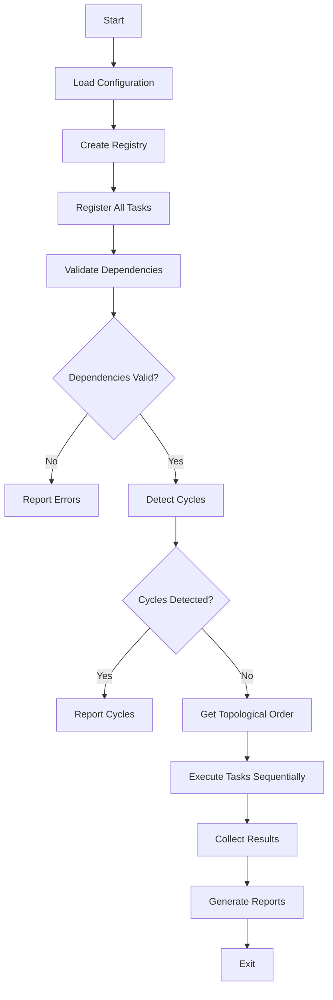
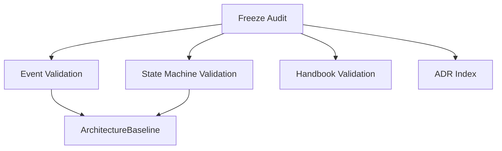

# Execution Model

> **Version**: 1.0.0
> **Last Updated**: 2026-07-15

## Overview

The Governance Platform uses a dependency-driven execution model. Tasks are executed in topological order, ensuring all dependencies are satisfied before a task runs.

## Execution Flow



## Task Execution Order

Tasks are executed based on their dependency graph:

1. **Freeze Audit** (no dependencies)
2. **Event Validation** (depends on: freeze-audit)
3. **State Machine Validation** (depends on: freeze-audit)
4. **Handbook Validation** (depends on: freeze-audit)
5. **ADR Index** (depends on: freeze-audit)
6. **ArchitectureBaseline** (depends on: event-validation, state-machine-validation)

## Dependency Graph



## Execution Semantics

### Sequential Execution

Tasks execute sequentially in topological order. This ensures:

1. **Dependency Satisfaction**: A task only runs after all its dependencies complete
2. **Result Availability**: Downstream tasks can use results from upstream tasks
3. **Deterministic Order**: Same dependency graph always produces same execution order

### Error Handling

- **Task Failure**: If a task throws, it returns `FAIL` status with error details
- **Continuation**: Other tasks continue executing even if one fails
- **Exit Code**: CLI returns non-zero exit code if any task fails

### Timing

Each task is timed automatically:

```typescript
const startTime = Date.now();
const result = await this.executeTask();
const durationMs = Date.now() - startTime;
```

## Parallel Execution (Future)

The current implementation is sequential. Future enhancements could support:

- **Parallel Execution**: Tasks without dependencies can run concurrently
- **Worker Threads**: CPU-intensive tasks can use worker threads
- **Streaming Results**: Real-time progress updates

## Configuration Impact

Configuration can affect execution:

- **enabledTasks**: Only listed tasks execute
- **disabledTasks**: Listed tasks are skipped
- **taskOrder**: Custom execution order (within dependency constraints)
- **failOnWarning**: Affects exit code behavior

## Performance Characteristics

| Metric | Value |
|--------|-------|
| Total Tasks | 6 |
| Total Execution Time | ~60ms |
| Average Task Time | ~10ms |
| Total Checks | 200+ |
| Memory Usage | ~50MB |

## Error Recovery

If a task fails:

1. Error is captured in `GovernanceResult.errors`
2. Task returns `FAIL` status
3. Execution continues to next task
4. Final exit code reflects any failures
